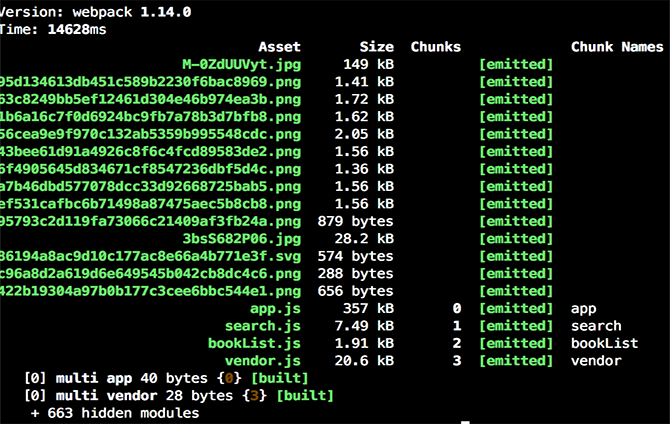

```javascript

import React from 'react';
import { Route, IndexRoute } from 'react-router';

import { AppContainer } from './appContainer';
import { HomeContainer } from './containers/Home/homeContainer';
//首页不变，搜索页面是子页面，我把他切割出来作为单独的一个js文件，cb里面有一个default，表示导出带有**default**的容器组件。
const searchContainer = (location, cb) => {
    require.ensure([], require => {
        cb(null, require('./containers/Search/searchContainer').default)
    },'search')
}

export default (
    <Route path="/" component={AppContainer}>
        <IndexRoute component={HomeContainer} />
        <Route path="home" component={HomeContainer} />
        <Route path="search" getComponent={searchContainer} />
    </Route>
);

```

```javascript

//入口文件
entry: {
    app: [
      'babel-polyfill',
      './src/index'
    ],
    vendor: ['react'] //提取react模块作为公共的js文件
  },

//输出文件
output: {
    filename: '[name].js', //注意这里，用[name]可以自动生成路由名称对应的js文件
    path: path.join(__dirname, 'build'),
    publicPath: '/build/',
    chunkFilename: '[name].js' //注意这里，用[name]可以自动生成路由名称对应的js文件
  },

//插件
plugins: [
//必须配置，react的公共模块
    new webpack.optimize.CommonsChunkPlugin({
      names: ['vendor'],
      filename: 'vendor.js'
    })
  ],

```


